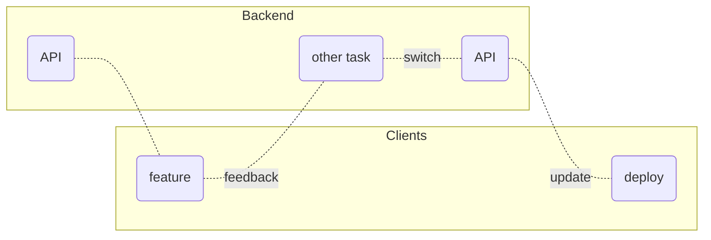
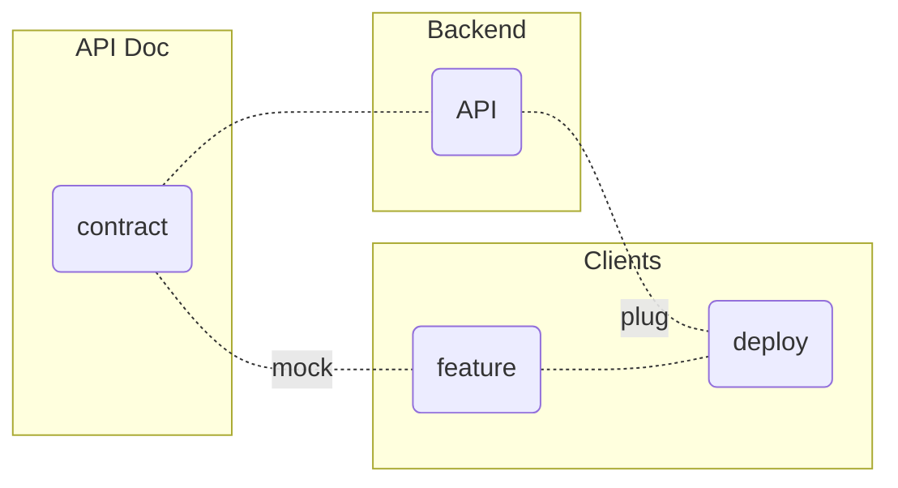

title: The rules of REST API
author:
  name: I'm Adrien, in charge of Sharing REST API group
  email: a.gibrat@oodrive.com
theme: ./theme
controls: false
output: index.html

--

# REST API @ 

## Rules & Feedback

--

## <small>1st rule</small> You document REST API

--

> Contract between backend and clients

- MUST be human readable
- SHOULD be easy to write
- MAY use [json-schema](http://json-schema.org/implementations.html)

--

## <small>2nd rule</small> You DOCUMENT REST API

--

The Waterfall mess 

--

vs. Documentation First

--

## <small>3rd rule</small> If backend or clients says&nbsp;"stop", fight is over

--

> API expectations

1. Usable <small>for clients</small>
2. Maintainable <small>by backend</small>
3. Extendable <small>to features</small>

<small>or it's a potential dead end</small>

--

## <small>4th rule</small> Only two kind of MR

--

> Branch convention

to sync API & doc

- implemented<small>/descriptive_branch_name</small>
- proposal<small>/descriptive_branch_name</small>

We use [Git Octopus](https://github.com/lesfurets/git-octopus) <small>for preview</small>

--

## <small>5th rule</small> One tooling at a time

--

> Tooling review

&nbsp;&nbsp;&nbsp;&nbsp;😭 [apiblueprint](https://apiblueprint.org) <small>& [aglio](https://github.com/danielgtaylor/aglio) sucks</small>
&nbsp;&nbsp;&nbsp;&nbsp;😔 [raml](https://raml.org) <small>has ecosystem issues</small>
&nbsp;&nbsp;&nbsp;&nbsp;😎 [openAPI](https://www.openapis.org) <small>& [swagger](https://swagger.io/) wins</small>

--

## <small>6th rule</small> No complexity, no&nbsp;contradiction

--

> KISS

- entities <small>MUST be</small> consistent
- complex <small>solutions</small> DON'T last
- <small>SHOULD use</small> simple <small>&</small> standard <small>solutions</small>

--

## <small>7th rule</small> API version will go on as long as they have to

--

> API versioning

- <small>client's</small> short support <small>policy</small>
- <small>long term</small> deprecation <small>notice</small>
- <small>delay & batch</small> breaking changes

We are moving from silos to [plateform](https://www.oodrive.com/products/oodrive-platform), 
major versions expected!

--

## <small>8th rule</small> If this is your first meeting,  you HAVE to write doc

--

## Thanks

© [The Rules of Fight Club](http://www.diggingforfire.net/fightclub)

