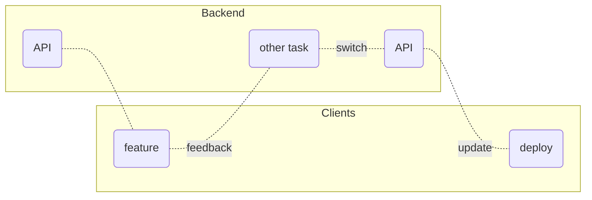
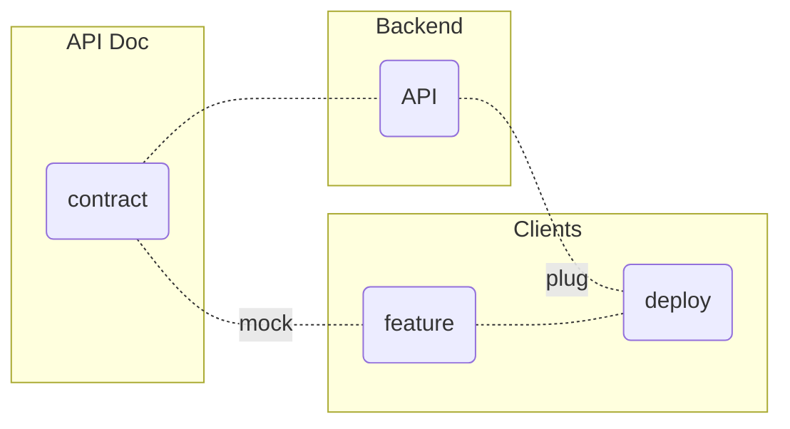

title: The rules of REST API
author:
  name: I'm Adrien, facilitator of the Sharing REST API group
  email: a.gibrat@oodrive.com
theme: ./theme
controls: false
output: index.html

--

# REST API @ 

## Rules & Feedback

--

## <small>1st rule</small> You document REST API

--

> Contract between backend and clients

- MUST be human readable
- SHOULD be easy to write
- MAY use [json-schema](http://json-schema.org/implementations.html)

--

## <small>2nd rule</small> You DOCUMENT REST API

--

The Waterfall mess 

--

vs. Documentation First

--

## <small>3rd rule</small> If backend or clients says&nbsp;"stop", fight is over

--

> API expectations

1. Usable <small>for clients (mobile, desktop, browser)</small>
2. Maintainable <small>by backend</small>
3. Extendable <small>to features</small>

--

## <small>4th rule</small> Only two kind of <acronym title="Merge Request" lang="en">MR</acronym>

--

> Sync API & doc

<small>with a</small> branch convention

- implemented<small>/descriptive_branch_name</small>
- proposal<small>/descriptive_branch_name</small>

<small>We use</small> [Git Octopus](https://github.com/lesfurets/git-octopus) <small>for preview</small>

--

## <small>5th feedback</small> One tooling at a time

--

> Tooling review

&nbsp;&nbsp;&nbsp;&nbsp;😭 [apiblueprint](https://apiblueprint.org) <small>& [aglio](https://github.com/danielgtaylor/aglio) sucks</small>
&nbsp;&nbsp;&nbsp;&nbsp;😔 [raml](https://raml.org) <small>has ecosystem issues</small>
&nbsp;&nbsp;&nbsp;&nbsp;😎 [openAPI](https://www.openapis.org) <small>& [swagger](https://swagger.io/) wins</small>

--

## <small>6th feedback</small> No GraphQL, no Gateway

--

> Considered alternatives

- [Backend For Frontend](https://samnewman.io/patterns/architectural/bff) <small>maintenance issues</small>
- [GraphQL](https://graphql.org) <small>performance concerns</small>
- [API Gateway](http://microservices.io/patterns/apigateway.html) <small>not ready yet</small>

--

## <small>7th <strike>rule</strike></small> API talks will go on as long as they have to

--

> So much more...

- <small>simple and durable</small> API design 
- <small>set up</small> API versioning
- <small>importance of</small> entities consistency
- <small>usefull</small> standards <small>and tricky ones</small>
- <small>from </small> silos to [plateform](https://www.oodrive.com/products/oodrive-platform)

--

## <small>8th rule</small> If this is your first API&nbsp;meeting,  you HAVE to write doc

--

## Thanks

© [The Rules of Fight Club](http://www.diggingforfire.net/fightclub)

